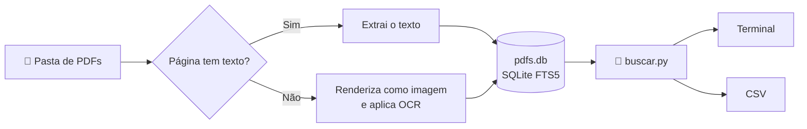

<div align="center">

# 🔎 PDFind

**Busca full-text em milhares de PDFs, inclusive escaneados, 100% local.**


</div>

---

## ✨ O que faz

O **PDFind** (*PDF + find*) lê uma pasta de PDFs, extrai o texto de cada página e guarda tudo num índice de busca local. A extração é demorada, mas acontece **uma única vez**. Depois disso, qualquer busca nos milhares de arquivos responde em milissegundos.

- 📄 **Extrai o texto** de PDFs digitais diretamente.
- 🖼️ **Faz OCR automático** nas páginas escaneadas, só nas que não têm texto.
- ⚡ **Processa vários arquivos em paralelo**, com barra de progresso por arquivo.
- 🔁 **Retoma de onde parou**: arquivos já indexados são pulados.
- 🔤 **Ignora acentos e maiúsculas**: `acao` encontra "Ação".
- 📊 **Exporta os resultados para CSV**, pronto para abrir no Excel.
- 🔒 **Roda totalmente offline** depois da instalação. Nenhum documento sai da sua máquina.

---

## ⚙️ Como funciona



1. **Varredura:** o `indexar.py` percorre a pasta e as subpastas em busca de arquivos `.pdf`.
2. **Extração página a página:** para cada página, ele tenta ler o texto embutido no PDF. Se a página tiver menos de 20 caracteres, ela é considerada escaneada e vai para o OCR.
3. **OCR:** a página é convertida em imagem e passa pelo Tesseract (embutido no PyMuPDF) com o modelo de português.
4. **Indexação:** o texto de cada página é gravado no SQLite com **FTS5**, o motor de busca full-text embutido no SQLite, que permite buscas por frase, operadores lógicos e ranking por relevância.
5. **Busca:** o `buscar.py` consulta o índice e mostra o arquivo, a página e um trecho com o termo destacado entre `[colchetes]`.

Cada arquivo é processado num **processo separado** (5 ao mesmo tempo, por padrão), aproveitando os vários núcleos do processador. A gravação no banco fica centralizada no processo principal, o que garante que o índice nunca fique corrompido, mesmo que a execução seja interrompida.

---

## 📂 Estrutura do projeto

```
PDFind/
├── indexar.py        # extrai o texto e monta o índice
├── buscar.py         # faz as buscas e exporta CSV
├── pdfs.db           # índice — criado automaticamente
├── tessdata/         # modelo de OCR — baixado automaticamente
└── PDFs/             # seus PDFs (pode ficar em qualquer lugar)
```

> [!IMPORTANT]
> O `pdfs.db` é criado na **pasta onde você roda o comando**. Rode sempre a partir da pasta do projeto, para que indexação e busca usem o mesmo banco.

---

## 📦 Dependências

| Componente | O que é usado | Precisa instalar? |
|---|---|:---:|
| **Runtime** | Python 3.10 ou superior | ✅ |
| **Leitura de PDF** | [PyMuPDF](https://pymupdf.readthedocs.io) | ✅ via pip |
| **OCR** | Tesseract embutido no PyMuPDF | ❌ |
| **Modelo de português** | `por.traineddata` ([tessdata_fast](https://github.com/tesseract-ocr/tessdata_fast)) | ❌ baixado sozinho |
| **Banco de dados** | `sqlite3` com FTS5 | ❌ já vem no Python |

Ou seja: **só o Python e um único pacote**. Não é preciso instalar o Tesseract nem o SQLite separadamente.

---

## 🚀 Instalação (Windows)

**1. Instale o Python**, se ainda não tiver. Confira com `py --version`.

```powershell
winget install Python.Python.3.13 --scope user
```

Depois, feche e abra o PowerShell de novo.

<details>
<summary>Sem winget ou sem permissão de administrador? Clique aqui.</summary>

**Opção A — instalador oficial:** baixe em [python.org/downloads](https://www.python.org/downloads/) e, na primeira tela, marque **"Add python.exe to PATH"**. Com "Install for all users" desmarcado, não precisa de admin.

**Opção B — uv** (um único executável, sem admin): ele baixa o Python e as dependências sozinho.

```powershell
powershell -ExecutionPolicy ByPass -c "irm https://astral.sh/uv/install.ps1 | iex"
uv run --with pymupdf indexar.py C:\caminho\dos\pdfs
uv run buscar.py "termo"
```

**Opção C — pacote portátil (zip):** baixe o *Windows embeddable package* em python.org, extraia numa pasta, adicione essa pasta ao PATH do usuário e habilite o pip editando o arquivo `python3xx._pth` (descomente a linha `import site`) e rodando o `get-pip.py`. Nesse caso, o comando é `python` em vez de `py`.

</details>

**2. Instale a dependência:**

```powershell
py -m pip install pymupdf
```

**3. Pronto.** Na primeira execução que precisar de OCR, o script baixa sozinho o modelo de português (~2 MB) para a pasta `tessdata/`.

---

## 🛠️ Uso

### 1. Indexar

```powershell
py indexar.py C:\Projetos\PDFind\PDFs
```

Durante a execução, cada arquivo concluído vira uma linha fixa, enquanto os que estão em andamento mostram sua própria barra:

```
16 PDFs encontrados, 0 já indexados, 16 a processar (5 em paralelo).

✓ 0a1b2c3d-....pdf: 5 pág. (5 texto, 0 OCR) em 0s
✓ 000e3be6-....pdf: 12 pág. (1 texto, 11 OCR) em 38s
⚠ 0f9e8d7c-....pdf: 1 pág. (0 texto, 1 OCR) em 3s — sem texto mesmo após OCR
  1a2b3c4d-a4c3-4ce9-8226-363d9ff585a6.pdf ███████████░░░░░░░░░ 7/12 pág. (7 OCR)
  2b3c4d5e-a4c3-4ce9-8226-363d9ff585a6.pdf ████░░░░░░░░░░░░░░░░ 2/9 pág. (2 OCR)
Total █████████░░░░░░░░░░░░░░░░░░░░░ 3/16 arquivos · 12 pág. OCR · 0 erros · 42s
```

| Símbolo | Significado |
|:---:|---|
| ✓ | Arquivo indexado com sucesso |
| ⚠ | Indexado, mas nenhum texto foi encontrado, nem com OCR |
| ✗ | Erro ao processar o arquivo (o motivo aparece na linha) |

Para adicionar PDFs novos, basta rodar o mesmo comando: só os arquivos ainda não indexados são processados. A indexação também pode ser interrompida a qualquer momento com <kbd>Ctrl</kbd>+<kbd>C</kbd> e continua de onde parou.

### 2. Buscar

```powershell
# Mostra até 50 resultados no terminal
py buscar.py "orçamento"

# Salva TODOS os resultados em CSV
py buscar.py "orçamento" --csv resultados.csv
```

O CSV tem as colunas `arquivo`, `pagina`, `trecho` e `caminho`. Ele usa `;` como separador e codificação UTF-8 com BOM, para abrir direto no Excel em português com os acentos corretos.

### 🔍 Sintaxe de busca

A busca usa a sintaxe do SQLite FTS5. Maiúsculas e acentos são ignorados.

| Você quer encontrar… | Digite |
|---|---|
| Páginas com as duas palavras | `orçamento manutenção` |
| A frase exata | `'"nota fiscal"'` |
| Uma palavra **ou** outra | `contrato OR convênio` |
| Uma palavra **sem** a outra | `contrato NOT aditivo` |
| Palavras que começam com… | `licita*` → licitação, licitante… |
| Palavras próximas (até 10 palavras de distância) | `'NEAR(reforma telhado, 10)'` |
| Combinações | `'"ata ordinária" AND (orçamento OR despesa)'` |

> [!TIP]
> No **PowerShell 5**, para buscar uma frase exata, escape as aspas internas: `py buscar.py '\"nota fiscal\"'`. No PowerShell 7 isso não é necessário.

---

## 🎛️ Configuração

As opções ficam no topo do `indexar.py`:

| Opção | Padrão | O que faz |
|---|:---:|---|
| `PARALELO` | `5` | Quantos arquivos são processados ao mesmo tempo. O ideal é próximo ao número de núcleos do processador. |
| `MIN_CARACTERES` | `20` | Abaixo disso, a página é considerada escaneada e vai para o OCR. |
| `DPI_OCR` | `150` | Resolução da imagem enviada ao OCR. Maior = mais preciso e mais lento. |
| `IDIOMA_OCR` | `por` | Idioma do OCR. Para outro idioma, troque também o `URL_MODELO` pelo arquivo `.traineddata` correspondente. |

---

## 🗄️ Estrutura do banco

O `pdfs.db` é um arquivo SQLite comum, que pode ser aberto em ferramentas como o [DB Browser for SQLite](https://sqlitebrowser.org).

```sql
-- Texto de cada página, indexado para busca
CREATE VIRTUAL TABLE docs USING fts5(
    path UNINDEXED,   -- caminho completo do PDF
    page UNINDEXED,   -- número da página
    text,             -- texto extraído (ou via OCR)
    tokenize = 'unicode61 remove_diacritics 2'
);

-- Controle de quais arquivos já foram processados
CREATE TABLE indexados (path TEXT PRIMARY KEY);
```

**Para reindexar tudo do zero**, apague o banco e rode o indexador de novo:

```powershell
del pdfs.db
```

> [!NOTE]
> Os caminhos completos dos PDFs ficam gravados no banco. Se você mover a pasta dos PDFs, eles serão vistos como arquivos novos e indexados de novo.

---

## 🧯 Solução de problemas

<details>
<summary><b>Digitar <code>python</code> abre a Microsoft Store</b></summary>

É um atalho do Windows. Use `py`, ou desative em *Configurações → Aplicativos → Configurações avançadas de aplicativos → Aliases de execução de aplicativo*.
</details>

<details>
<summary><b><code>py</code> não é reconhecido como comando</b></summary>

O Python não está instalado ou não está no PATH. Feche e abra o PowerShell depois de instalar. Se instalou pelo zip portátil, use `python` em vez de `py`.
</details>

<details>
<summary><b>Arquivos com ✗ e erro de OCR / tessdata</b></summary>

O modelo de português não foi baixado, normalmente por falta de internet na primeira execução. Baixe manualmente o arquivo [`por.traineddata`](https://github.com/tesseract-ocr/tessdata_fast/raw/main/por.traineddata), coloque-o na pasta `tessdata/` ao lado do `indexar.py` e rode de novo.
</details>

<details>
<summary><b>Muitos arquivos aparecem com ⚠ "sem texto"</b></summary>

Verifique se o PDF tem conteúdo legível: abra o arquivo e tente selecionar o texto. Se for uma digitalização de baixa qualidade, aumente `DPI_OCR` para `200` ou mais. Páginas realmente em branco também aparecem assim.
</details>

<details>
<summary><b>A busca não encontra uma palavra que está no PDF</b></summary>

- Confirme que você está rodando a busca na mesma pasta onde está o `pdfs.db`.
- Se a página veio de OCR, a palavra pode ter sido reconhecida com erro. Tente um prefixo, como `manuten*`.
- Lembre que palavras separadas por espaço precisam estar **todas** na mesma página.
</details>

<details>
<summary><b>A indexação está lenta</b></summary>

O OCR é a etapa mais pesada: alguns segundos por página escaneada, contra milissegundos para páginas digitais. Ajuste `PARALELO` ao número de núcleos da máquina. Se as digitalizações forem boas, reduzir `DPI_OCR` para `120` também acelera.
</details>

---

## 🔒 Privacidade

Tudo é processado **localmente**. A internet só é usada para instalar o PyMuPDF e baixar o modelo de OCR na primeira execução. O conteúdo dos PDFs nunca é enviado para lugar nenhum.

Depois de instalado, o PDFind funciona sem conexão: para usar em outra máquina, basta copiar a pasta do projeto, com a `tessdata/`, e instalar o PyMuPDF.
