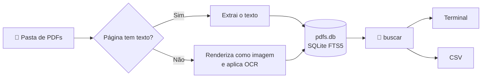

<div align="center">

# 🔎 BuscaAtas

**Busca full-text em milhares de PDFs, inclusive escaneados, 100% local.**


</div>

---

## ✨ O que faz

O BuscaAtas lê uma pasta de PDFs, extrai o texto de cada página e guarda tudo num índice de busca local. A extração é demorada, mas acontece **uma única vez**. Depois disso, qualquer busca nos milhares de arquivos responde em milissegundos.

- 📄 **Extrai o texto** de PDFs digitais diretamente.
- 🖼️ **Faz OCR automático** nas páginas escaneadas, só nas que não têm texto.
- ⚡ **Processa vários arquivos em paralelo**, com barra de progresso por arquivo.
- 🔁 **Retoma de onde parou**: arquivos já indexados são pulados.
- 🔤 **Ignora acentos e maiúsculas**: `acao` encontra "Ação".
- 📊 **Exporta os resultados para CSV**, pronto para abrir no Excel.
- 🔒 **Roda totalmente offline** depois da instalação. Nenhum documento sai da sua máquina.

Existem **duas versões equivalentes**, uma em Python e outra em Node.js. As duas usam o mesmo banco (`pdfs.db`), então você pode indexar com uma e buscar com a outra. Para grandes volumes, a versão **Python é a recomendada**, por ser mais rápida.

---

## ⚙️ Como funciona



1. **Varredura:** o indexador percorre a pasta e as subpastas em busca de arquivos `.pdf`.
2. **Extração página a página:** para cada página, ele tenta ler o texto embutido no PDF. Se a página tiver menos de 20 caracteres, ela é considerada escaneada e vai para o OCR.
3. **OCR:** a página é convertida em imagem e passa pelo Tesseract com o modelo de português.
4. **Indexação:** o texto de cada página é gravado no SQLite com **FTS5**, o motor de busca full-text embutido no SQLite, que permite buscas por frase, operadores lógicos e ranking por relevância.
5. **Busca:** o script de busca consulta o índice e mostra o arquivo, a página e um trecho com o termo destacado entre `[colchetes]`.

---

## 📂 Estrutura do projeto

```
BuscaAtas/
├── indexar.py        # indexador (Python)
├── buscar.py         # busca (Python)
├── indexar.mjs       # indexador (Node.js)
├── buscar.mjs        # busca (Node.js)
├── pdfs.db           # índice — criado automaticamente
├── tessdata/         # modelo de OCR do Python — baixado automaticamente
└── Atas/             # seus PDFs (pode ficar em qualquer lugar)
```

> [!IMPORTANT]
> O `pdfs.db` é criado na **pasta onde você roda o comando**. Rode sempre a partir da pasta do projeto, para que indexação e busca usem o mesmo banco.

---

## 📦 Dependências

| | 🐍 Python | 🟩 Node.js |
|---|---|---|
| **Runtime** | Python 3.10 ou superior | Node.js 22.13 ou superior |
| **Leitura de PDF** | [PyMuPDF](https://pymupdf.readthedocs.io) | [pdfjs-dist](https://github.com/mozilla/pdf.js) |
| **Renderização** | PyMuPDF | [@napi-rs/canvas](https://github.com/Brooooooklyn/canvas) |
| **OCR** | Tesseract embutido no PyMuPDF | [tesseract.js](https://github.com/naptha/tesseract.js) |
| **Banco** | `sqlite3` (já vem no Python) | `node:sqlite` (já vem no Node) |
| **Modelo de português** | Baixado para `./tessdata` na 1ª execução | Baixado pelo tesseract.js na 1ª execução |

Nenhuma das versões exige instalar o Tesseract nem o SQLite separadamente.

---

## 🚀 Instalação (Windows)

### 🐍 Versão Python

**1. Instale o Python**, se ainda não tiver. Confira com `py --version`.

```powershell
winget install Python.Python.3.13 --scope user
```

<details>
<summary>Sem winget ou sem permissão de administrador? Clique aqui.</summary>

Opção A — **uv** (um único executável, sem admin):

```powershell
powershell -ExecutionPolicy ByPass -c "irm https://astral.sh/uv/install.ps1 | iex"
uv run --with pymupdf indexar.py C:\caminho\dos\pdfs
```

Opção B — **pacote portátil (zip)**: baixe o *Windows embeddable package* em python.org, extraia numa pasta, adicione essa pasta ao PATH do usuário e habilite o pip editando o arquivo `python3xx._pth` (descomente a linha `import site`) e rodando o `get-pip.py`. Nesse caso, o comando é `python` em vez de `py`.

</details>

**2. Instale a dependência:**

```powershell
py -m pip install pymupdf
```

Pronto. Na primeira execução com OCR, o script baixa sozinho o modelo `por.traineddata` (~2 MB).

### 🟩 Versão Node.js

**1. Instale o Node.js**, se ainda não tiver. Confira com `node --version`.

```powershell
winget install OpenJS.NodeJS.LTS
```

**2. Libere a execução de scripts do npm** (uma vez só, sem admin):

```powershell
Set-ExecutionPolicy -Scope CurrentUser RemoteSigned
```

> Se a sua máquina não permitir, use `npm.cmd` no lugar de `npm` nos comandos abaixo.

**3. Instale as dependências** na pasta do projeto:

```powershell
npm init -y
npm install pdfjs-dist @napi-rs/canvas tesseract.js
```

Na primeira execução com OCR, o tesseract.js baixa o modelo de português (~15 MB) e o guarda na pasta do projeto.

---

## 🛠️ Uso

### 1. Indexar

```powershell
# Python
py indexar.py C:\Projetos\BuscaAtas\Atas

# Node.js
node --no-warnings indexar.mjs C:\Projetos\BuscaAtas\Atas
```

Durante a execução, cada arquivo concluído vira uma linha fixa, enquanto os que estão em andamento mostram sua própria barra:

```
16 PDFs encontrados, 0 já indexados, 16 a processar (5 em paralelo).

✓ 0a1b2c3d-....pdf: 5 pág. (5 texto, 0 OCR) em 0s
✓ 000e3be6-....pdf: 12 pág. (1 texto, 11 OCR) em 38s
⚠ 0f9e8d7c-....pdf: 1 pág. (0 texto, 1 OCR) em 3s — sem texto mesmo após OCR
  1a2b3c4d-a4c3-4ce9-8226-363d9ff585a6.pdf ███████████░░░░░░░░░ 7/12 pág. (7 OCR)
  2b3c4d5e-a4c3-4ce9-8226-363d9ff585a6.pdf ████░░░░░░░░░░░░░░░░ 2/9 pág. (2 OCR)
Total █████████░░░░░░░░░░░░░░░░░░░░░ 3/16 arquivos · 12 pág. OCR · 0 erros · 42s
```

| Símbolo | Significado |
|:---:|---|
| ✓ | Arquivo indexado com sucesso |
| ⚠ | Indexado, mas nenhum texto foi encontrado, nem com OCR |
| ✗ | Erro ao processar o arquivo (o motivo aparece na linha) |

Para adicionar PDFs novos, basta rodar o mesmo comando: só os arquivos ainda não indexados são processados.

### 2. Buscar

```powershell
# Mostra até 50 resultados no terminal
py buscar.py "orçamento"

# Salva TODOS os resultados em CSV
py buscar.py "orçamento" --csv resultados.csv
```

> Na versão Node.js, troque `py buscar.py` por `node --no-warnings buscar.mjs`.

O CSV tem as colunas `arquivo`, `pagina`, `trecho` e `caminho`. Ele usa `;` como separador e codificação UTF-8 com BOM, para abrir direto no Excel em português com os acentos corretos.

### 🔍 Sintaxe de busca

A busca usa a sintaxe do SQLite FTS5. Maiúsculas e acentos são ignorados.

| Você quer encontrar… | Digite |
|---|---|
| Páginas com as duas palavras | `orçamento manutenção` |
| A frase exata | `'"nota fiscal"'` |
| Uma palavra **ou** outra | `contrato OR convênio` |
| Uma palavra **sem** a outra | `contrato NOT aditivo` |
| Palavras que começam com… | `licita*` → licitação, licitante… |
| Palavras próximas (até 10 palavras de distância) | `'NEAR(reforma telhado, 10)'` |
| Combinações | `'"ata ordinária" AND (orçamento OR despesa)'` |

> [!TIP]
> No **PowerShell 5**, para buscar uma frase exata, escape as aspas internas: `py buscar.py '\"nota fiscal\"'`. No PowerShell 7 isso não é necessário.

---

## 🎛️ Configuração

As opções ficam no topo do `indexar.py` / `indexar.mjs`:

| Opção | Padrão | O que faz |
|---|:---:|---|
| `PARALELO` | `5` | Quantos arquivos são processados ao mesmo tempo. O ideal é próximo ao número de núcleos do processador. |
| `MIN_CARACTERES` | `20` | Abaixo disso, a página é considerada escaneada e vai para o OCR. |
| `DPI_OCR` *(Python)* | `150` | Resolução da imagem enviada ao OCR. Maior = mais preciso e mais lento. |
| `ESCALA_OCR` *(Node)* | `2` | O mesmo, em escala (2 ≈ 144 DPI). |
| `IDIOMA_OCR` *(Python)* | `por` | Idioma do OCR. |

---

## 🗄️ Estrutura do banco

O `pdfs.db` é um arquivo SQLite comum, que pode ser aberto em ferramentas como o [DB Browser for SQLite](https://sqlitebrowser.org).

```sql
-- Texto de cada página, indexado para busca
CREATE VIRTUAL TABLE docs USING fts5(
    path UNINDEXED,   -- caminho completo do PDF
    page UNINDEXED,   -- número da página
    text,             -- texto extraído (ou via OCR)
    tokenize = 'unicode61 remove_diacritics 2'
);

-- Controle de quais arquivos já foram processados
CREATE TABLE indexados (path TEXT PRIMARY KEY);
```

**Para reindexar tudo do zero**, apague o banco e rode o indexador de novo:

```powershell
del pdfs.db
```

---

## 🧯 Solução de problemas

<details>
<summary><b><code>npm.ps1 não pode ser carregado porque a execução de scripts foi desabilitada</code></b></summary>

Rode uma vez `Set-ExecutionPolicy -Scope CurrentUser RemoteSigned`, ou use `npm.cmd` no lugar de `npm`.
</details>

<details>
<summary><b>Digitar <code>python</code> abre a Microsoft Store</b></summary>

É um atalho do Windows. Use `py`, ou desative em *Configurações → Aplicativos → Configurações avançadas de aplicativos → Aliases de execução de aplicativo*.
</details>

<details>
<summary><b>Muitos arquivos aparecem com ⚠ "sem texto"</b></summary>

Verifique se o PDF tem conteúdo legível: abra o arquivo e tente selecionar o texto. Se for uma digitalização de baixa qualidade, aumente `DPI_OCR` (Python) ou `ESCALA_OCR` (Node). Páginas realmente em branco também aparecem assim.
</details>

<details>
<summary><b>Mensagens <code>Image too small to scale</code> ou <code>Line cannot be recognized</code></b></summary>

São avisos inofensivos do Tesseract sobre regiões minúsculas da imagem, como bordas, linhas de tabela ou traços de assinatura. O restante da página é reconhecido normalmente. Os scripts já tentam silenciá-los.
</details>

<details>
<summary><b>A busca não encontra uma palavra que está no PDF</b></summary>

- Confirme que você está rodando a busca na mesma pasta onde está o `pdfs.db`.
- Se a página veio de OCR, a palavra pode ter sido reconhecida com erro. Tente um prefixo, como `manuten*`.
- Lembre que palavras separadas por espaço precisam estar **todas** na mesma página.
</details>

<details>
<summary><b>A indexação está lenta</b></summary>

O OCR é a etapa mais pesada: alguns segundos por página escaneada, contra milissegundos para páginas digitais. Ajuste `PARALELO` ao número de núcleos da máquina e prefira a versão Python. A indexação pode ser interrompida a qualquer momento com <kbd>Ctrl</kbd>+<kbd>C</kbd> e continua de onde parou.
</details>

---

## 🔒 Privacidade

Tudo é processado **localmente**. A internet só é usada para instalar as dependências e baixar o modelo de OCR na primeira execução. O conteúdo dos PDFs nunca é enviado para lugar nenhum. Depois de instalado, o projeto funciona sem conexão: basta copiar a pasta inteira, com `tessdata/` ou `node_modules/`, para outra máquina.
